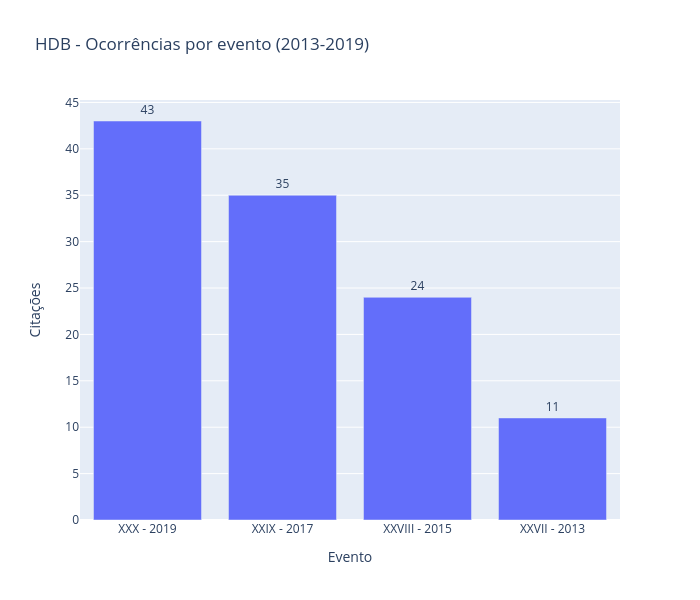
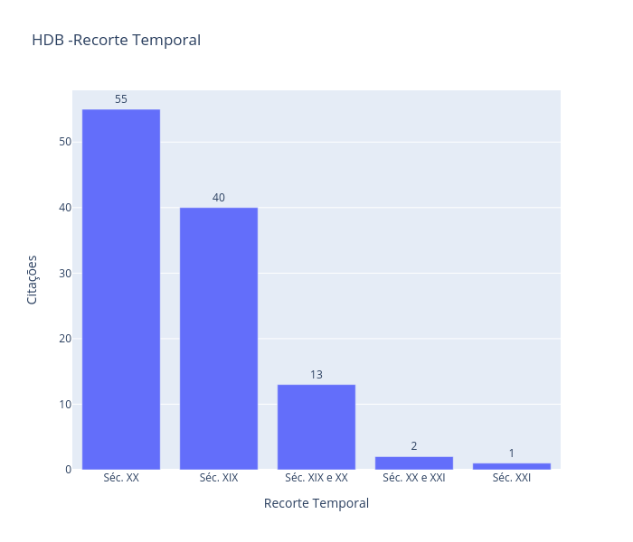
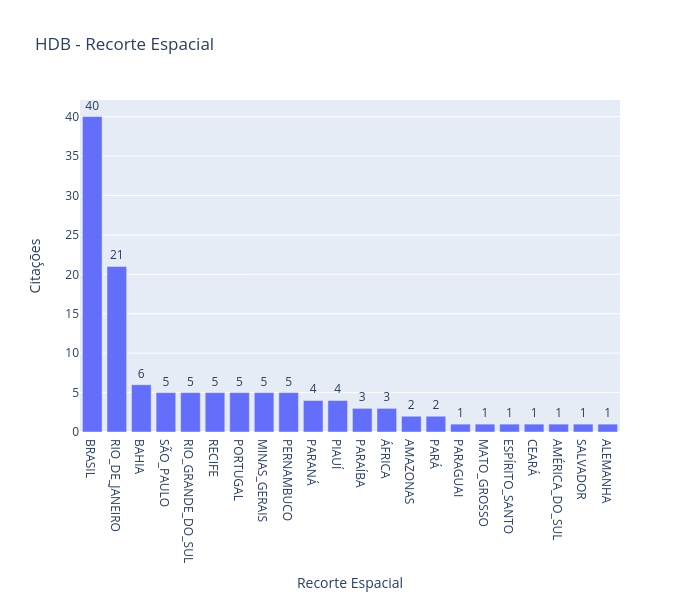

# PIBIC FAPESB

Bolsista Ana Carolina

Análises do Atlas.ti.

## 1. Introdução

* Apresentar a árvore de código e as estratégias de codificação
* objetivos da codificação e a análise que será feita.

## 2. Dados gerais e os totais de ocorrências.

### 2.1. Total de papers com menção à HDB.

* Apresentar o total de papers;
* Explicar os termos usados no auto-coding

### 2.2. Totais por evento.
* Quantitativo + Gráfico;

* Que conclusão é possível tirar?

## 3. Usos na pesquisa

Como a HDB tem sido utilizada?

### 3.1 Recorte Temporal:

* Quantitativo + Gráfico;

Que conclusão é possível tirar?

### 3.2. Recorte Espacial
* Quantitativo + Gráfico;

* Que conclusão é possível tirar?

### 3.3. Temáticas principais

* Quantitativo + Gráfico;

* Que conclusão é possível tirar?

## 4. Questões metodológicas

Como a HDB é compreendida pelos autores dos papers?

* Quantitativo + Gráfico;

Metodologia:

* Que conclusão é possível tirar?

5. Conclusões
